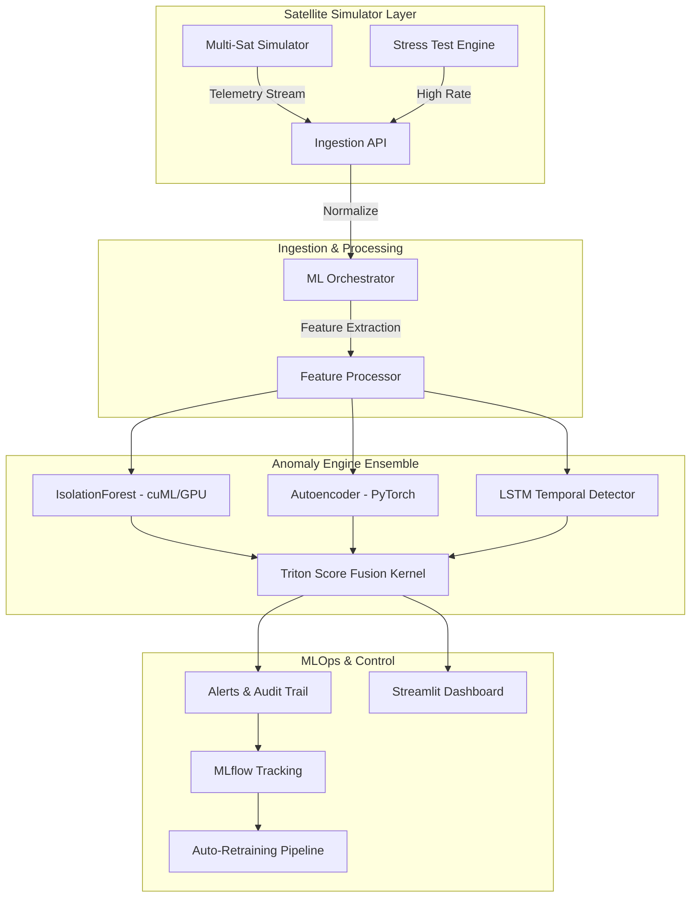

# 🛰️ Orbit-Q — Distributed ML Satellite Telemetry Platform

**Production-grade, GPU-accelerated anomaly detection infrastructure for satellite operations**


---

## 📖 Overview

Orbit-Q is a **systems-level ML infrastructure platform** specifically designed for satellite telemetry anomaly detection. Engineered for production-scale reliability, it provides an end-to-end pipeline from high-frequency telemetry ingestion to multi-model ensemble detection and operator-facing command & control dashboards.

## ✨ Key Features

- **🚀 Performance**: GPU-accelerated ensemble detection with Triton CUDA kernels for nanosecond-level score fusion.
- **🏗️ Resilient Ingestion**: High-throughput REST/gRPC endpoints with automated event-schema mapping and fallback mechanisms.
- **🧠 Advanced ML**: Multi-model ensemble combining `IsolationForest` (global outliers), PyTorch `Autoencoder` (feature manifold), and `LSTM` (temporal patterns).
- **♻️ MLOps Lifecycle**: Automated drift-detection and retraining pipelines with full MLflow lineage tracking.
- **🛡️ Mission Security**: HMAC-SHA256 stream token authentication with comprehensive audit trail logging.
- **📊 Command Center**: A 10-page Streamlit suite for live telemetry, mission diagnostics, and performance auditing.

---

## 🏗️ Architecture

Orbit-Q follows a decoupled, modular architecture designed for high availability and low latency.



### Detailed Package Structure

- [`src/orbit_q/`](file:///home/rhutvik/orbit-Q/src/orbit_q)
    - [`cli.py`](file:///home/rhutvik/orbit-Q/src/orbit_q/cli.py): Main entry point with 6 mission-critical commands.
    - [`engine/`](file:///home/rhutvik/orbit-Q/src/orbit_q/engine): Core ML ensemble and custom CUDA kernels for score fusion.
    - [`ingestion/`](file:///home/rhutvik/orbit-Q/src/orbit_q/ingestion): High-frequency telemetry entry point (REST/gRPC).
    - [`orchestrator/`](file:///home/rhutvik/orbit-Q/src/orbit_q/orchestrator): Central rules engine and stream processing coordinator.
    - [`dashboard/`](file:///home/rhutvik/orbit-Q/src/orbit_q/dashboard): Full-stack Streamlit C2 interface.
    - [`mlflow_tracking/`](file:///home/rhutvik/orbit-Q/src/orbit_q/mlflow_tracking): Experiment lineage and automated model maintenance.
    - [`simulator/`](file:///home/rhutvik/orbit-Q/src/orbit_q/simulator): Fault-injection telemetry generators for testing.

---

## 🚀 Quick Start

### Prerequisites
- Python 3.9+
- CUDA 11.8+ (Required for GPU acceleration features)
- Virtual Environment (Recommended)

### Installation

1. **Clone and Setup**:
   ```bash
   git clone https://github.com/poojakira/orbit-Q.git
   cd orbit-Q
   python -m venv .venv
   source .venv/bin/activate  # Linux/macOS
   # .venv\Scripts\activate  # Windows
   ```

2. **Install Dependencies**:
   ```bash
   pip install -e .          # Standard installation
   pip install -e ".[gpu]"   # Enable GPU acceleration (requires PyTorch/CUDA)
   pip install -e ".[dev]"   # Development tools (testing, linting)
   ```

### Configuration
Create a `.env` file or export environment variables for mission-specific settings:
```bash
# Security (Required for authenticated streams)
ORBIT_Q_SIGNING_SECRET=your-secure-secret-key

# MLflow (Database tracking)
MLFLOW_TRACKING_URI=sqlite:///mlruns/orbit_q.db

# Optional: External Integrations
FIREBASE_DB_URL=https://your-project.firebaseio.com
SLACK_WEBHOOK_URL=https://hooks.slack.com/services/...
```

---

## 💻 CLI Usage

The `orbit-q` command provides a unified interface for all project modules:

| Command | Description |
|---|---|
| `orbit-q simulator` | Start a single-satellite mock telemetry stream. |
| `orbit-q orchestrator`| Run the ML pipeline and rule-dispatch daemon. |
| `orbit-q dashboard` | Launch the Streamlit command center (default :8501). |
| `orbit-q benchmark` | Execute a high-rate throughput and latency stress test. |
| `orbit-q stress-test`| Simulate multiple concurrent satellite streams. |
| `orbit-q retrain` | Manually trigger the ensemble retraining pipeline. |

---

## 🛡️ Reliability & Security

Orbit-Q is built to handle the harsh realities of space-ground communication:

- **Auth**: Stateless HMAC stream tokens with defined TTL (time-to-live).
- **Graceful Fallback**: Automatic CPU fallback if cuML/GPU components are unavailable.
- **Resilient Data**: Logic to handle missing packets, latency jitter, and corrupted (NaN) sensor inputs.
- **Audit**: Every detected anomaly and system command is recorded in a tamper-proof audit trail.

---

## 🧪 Testing

We maintain a strict testing regimen with high coverage requirements:

```bash
pytest tests/ -v                                # Run core test suites
pytest tests/ --cov=src --cov-report=html       # Generate coverage report
```

### Verified Test Suites
- **ML Engine**: Ensemble initialization, cross-validation, and prediction accuracy.
- **Simulator**: Packet schema integrity and fault-injection accuracy.
- **Security**: HMAC validation, token expiry, and unauthorized access prevention.

---

## 🤝 Contributing

Contributions to Orbit-Q are welcome! Please follow these steps:
1. Fork the repository.
2. Create a feature branch (`git checkout -b feature/amazing-feature`).
3. Ensure all tests pass (`pytest`).
4. Submit a Pull Request with a detailed description of your changes.

---

## 📜 License

Distributed under the **MIT License**. See [`LICENSE`](file:///home/rhutvik/orbit-Q/LICENSE) for more information.

## 👥 Acknowledgments

Developed and maintained by:
- **Pooja Kiran (@poojakira)** - Core ML architecture, MLOps, and score fusion kernels.
- **Rhutvik Pachghare (@Rhutvik-Pachghare)** - Distributed orchestration, simulation engines, and C2 dashboard.
ock mode |
| Missing packet | Simulator skips + logs warning; orchestrator handles `None` |
| Delayed packet | Timestamps backdated; orchestrator filters stale |
| Corrupted data (`NaN`, -9999) | Preprocessor normalizes/drops; no crash |
| PyTorch DLL failure (Windows) | `TORCH_AVAILABLE` guard; AE disabled gracefully |
| Ingestion Overflow | gRPC buffering + load balancing (REST fallback) |
| Missing credentials | Firebase/MLflow init in try/except; logs warning |
| Token expiry/tamper | HMAC validates + TTL enforced; audit event written |

---

## 📐 Design Decisions

| Decision | Rationale |
|---|---|
| `sklearn` → `cuML` fallback | Portability without sacrificing GPU performance on CUDA machines |
| Ensemble: IF + AE + LSTM | IF catches global outliers, AE learns feature manifold, LSTM models temporal context |
| Triton kernel for fusion | Avoids Python overhead for high-frequency (200 Hz+) score combining |
| DDP via `mp.spawn` | SLURM-compatible; no dependency on Horovod/Ray for standard multi-GPU |
| Drift-based retraining | Prevents model staleness under changing sensor calibrations |
| `src/` layout | Prevents accidental uninstalled imports; pip-installable package best practice |
| HMAC stream tokens | Stateless auth with TTL; no DB lookup needed for token validation |

---

## 🎮 Operator Dashboard (10-Page Suite)

The Orbit-Q command center is powered by an extensive Streamlit interface organized into specialized mission control modules:

1.  **01 Live Telemetry**: High-frequency streaming charts for all satellite subsystems.
2.  **02 Alert & Command**: Real-time anomaly log with interactive operator intervention tools.
3.  **03 Hardware Diagnostics**: Deep-dive into thermal, electrical, and mechanical telemetry.
4.  **04 Orbital Tracking**: TLE-based position visualization and signal lock status.
5.  **05 Raw Telemetry Logs**: Searchable database of all historical telemetry packets.
6.  **06 Performance Audit**: **MLOps compliance** tracker; accuracy vs. contamination audit.
7.  **07 Inference Latency**: Microsecond-level tracking of GPU engine performance.
8.  **08 MLflow Lineage**: Full experiment lineage; tracks every mission pulse and model run.
9.  **09 Model Retraining**: Manual trigger interface for the ensemble retraining pipeline.
10. **10 Endpoint Health**: Real-time status of the ingestion API and downstream services.


## Ownership

- ML system and MLOps: **Pooja Kiran (@poojakira)**
- Mission control, simulators, and dashboards: **Rhutvik Pachghare (@Rhutvik-Pachghare)**

