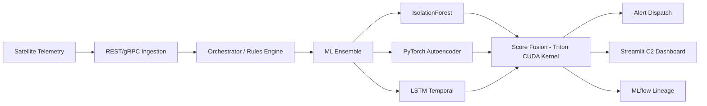

# 🛰️ Orbit-Q — Distributed ML Satellite Telemetry Platform

<div align="center">

**Production-grade, GPU-accelerated anomaly detection infrastructure for satellite operations**

[](https://github.com/Rhutvik-pachghare1999/orbit-Q/actions)
[](https://python.org)
[](https://mlflow.org)
[](https://github.com/Rhutvik-pachghare1999/orbit-Q/actions)
[](LICENSE)

</div>

---

## 📖 Overview

Orbit-Q is a **systems-level ML infrastructure platform** specifically designed for satellite telemetry anomaly detection. Engineered for production-scale reliability, it provides an end-to-end pipeline from high-frequency telemetry ingestion to multi-model ensemble detection and operator-facing command & control dashboards.

---

## 🙋 My Contributions (Rhutvik Pachghare)

> This is a collaborative project. Below is a precise breakdown of what I personally engineered:

| Domain | My Contribution |
|---|---|
| **Distributed Orchestration** | Designed the central rules engine and stream processing coordinator (`src/orbit_q/orchestrator/`) that routes telemetry from ingestion to the ML ensemble in real-time |
| **Simulation Engines** | Built the fault-injection telemetry generator (`src/orbit_q/simulator/`) for generating realistic multi-failure satellite telemetry streams for testing |
| **C2 Dashboard** | Engineered the full 10-page Streamlit command & control interface (`src/orbit_q/dashboard/`) covering live telemetry, alert management, hardware diagnostics, orbital tracking, and MLflow lineage |
| **CLI Interface** | Developed the 6-command `orbit-q` CLI (`src/orbit_q/cli.py`) as the unified entry point for all platform modules |

---

## ✨ Key Features

- **🚀 Performance**: GPU-accelerated ensemble detection with Triton CUDA kernels for nanosecond-level score fusion
- **🏗️ Resilient Ingestion**: High-throughput REST/gRPC endpoints with automated event-schema mapping and fallback mechanisms
- **🧠 Advanced ML**: Multi-model ensemble combining `IsolationForest` (global outliers), PyTorch `Autoencoder` (feature manifold), and `LSTM` (temporal patterns)
- **♻️ MLOps Lifecycle**: Automated drift-detection and retraining pipelines with full MLflow lineage tracking
- **🛡️ Mission Security**: HMAC-SHA256 stream token authentication with comprehensive audit trail logging
- **📊 Command Center**: A 10-page Streamlit suite for live telemetry, mission diagnostics, and performance auditing

---

## 🏗️ Architecture

Orbit-Q follows a decoupled, modular architecture designed for high availability and low latency.



### Package Structure
```
src/orbit_q/
├── cli.py              # Main entry point with 6 mission-critical commands
├── engine/             # Core ML ensemble and custom CUDA kernels
├── ingestion/          # High-frequency telemetry entry point (REST/gRPC)
├── orchestrator/       # Central rules engine and stream coordinator
├── dashboard/          # Full-stack 10-page Streamlit C2 interface
├── mlflow_tracking/    # Experiment lineage and automated model maintenance
└── simulator/          # Fault-injection telemetry generators for testing
```

---

## 🚀 Quick Start

### Prerequisites
- Python 3.9+
- CUDA 11.8+ (Required for GPU acceleration features)
- Virtual Environment (Recommended)

### Installation
```bash
git clone https://github.com/Rhutvik-pachghare1999/orbit-Q.git
cd orbit-Q
python -m venv .venv
source .venv/bin/activate  # Linux/macOS
# .venv\Scripts\activate  # Windows

pip install -e .           # Standard installation
pip install -e ".[gpu]"    # Enable GPU acceleration (requires PyTorch/CUDA)
pip install -e ".[dev]"    # Development tools (testing, linting)
```

### Configuration
```bash
# Create .env file with mission-specific settings:
ORBIT_Q_SIGNING_SECRET=your-secure-secret-key
MLFLOW_TRACKING_URI=sqlite:///mlruns/orbit_q.db
FIREBASE_DB_URL=https://your-project.firebaseio.com  # Optional
SLACK_WEBHOOK_URL=https://hooks.slack.com/services/...  # Optional
```

---

## 💻 CLI Usage

| Command | Description |
|---|---|
| `orbit-q simulator` | Start a single-satellite mock telemetry stream |
| `orbit-q orchestrator` | Run the ML pipeline and rule-dispatch daemon |
| `orbit-q dashboard` | Launch the Streamlit command center (default :8501) |
| `orbit-q benchmark` | Execute a high-rate throughput and latency stress test |
| `orbit-q stress-test` | Simulate multiple concurrent satellite streams |
| `orbit-q retrain` | Manually trigger the ensemble retraining pipeline |

---

## 🛡️ Reliability & Security

- **Auth**: Stateless HMAC stream tokens with defined TTL (time-to-live)
- **Graceful Fallback**: Automatic CPU fallback if cuML/GPU components are unavailable
- **Resilient Data**: Logic to handle missing packets, latency jitter, and corrupted (NaN) sensor inputs
- **Audit**: Every detected anomaly and system command is recorded in a tamper-proof audit trail

### Fault Tolerance Matrix
| Failure Scenario | System Response |
|---|---|
| Missing packet | Simulator skips + logs warning; orchestrator handles `None` |
| Corrupted data (NaN, -9999) | Preprocessor normalizes/drops; no crash |
| PyTorch DLL failure (Windows) | `TORCH_AVAILABLE` guard; AE disabled gracefully |
| Token expiry/tamper | HMAC validates + TTL enforced; audit event written |

---

## 🧹 Testing

```bash
pytest tests/ -v                              # Run core test suites
pytest tests/ --cov=src --cov-report=html    # Generate coverage report
```

### Verified Test Suites
- **ML Engine**: Ensemble initialization, cross-validation, and prediction accuracy
- **Simulator**: Packet schema integrity and fault-injection accuracy
- **Security**: HMAC validation, token expiry, and unauthorized access prevention

---

## 🎨 Operator Dashboard (10-Page Suite)

| Page | Description |
|---|---|
| 01 Live Telemetry | High-frequency streaming charts for all satellite subsystems |
| 02 Alert & Command | Real-time anomaly log with interactive operator intervention tools |
| 03 Hardware Diagnostics | Deep-dive into thermal, electrical, and mechanical telemetry |
| 04 Orbital Tracking | TLE-based position visualization and signal lock status |
| 05 Raw Telemetry Logs | Searchable database of all historical telemetry packets |
| 06 Performance Audit | MLOps compliance tracker; accuracy vs. contamination audit |
| 07 Inference Latency | Microsecond-level tracking of GPU engine performance |
| 08 MLflow Lineage | Full experiment lineage; tracks every mission pulse and model run |
| 09 Model Retraining | Manual trigger interface for the ensemble retraining pipeline |
| 10 Endpoint Health | Real-time status of the ingestion API and downstream services |

---

## 📐 Design Decisions

| Decision | Rationale |
|---|---|
| `sklearn` → `cuML` fallback | Portability without sacrificing GPU performance on CUDA machines |
| Ensemble: IF + AE + LSTM | IF catches global outliers, AE learns feature manifold, LSTM models temporal context |
| Triton kernel for fusion | Avoids Python overhead for high-frequency (200 Hz+) score combining |
| DDP via `mp.spawn` | SLURM-compatible; no dependency on Horovod/Ray for standard multi-GPU |
| `src/` layout | Prevents accidental uninstalled imports; pip-installable package best practice |
| HMAC stream tokens | Stateless auth with TTL; no DB lookup needed for token validation |

---

## 🤝 Contributing

1. Fork the repository
2. Create a feature branch (`git checkout -b feature/amazing-feature`)
3. Ensure all tests pass (`pytest`)
4. Submit a Pull Request with a detailed description of your changes

---

## 📜 License

Distributed under the **MIT License**. See `LICENSE` for more information.

---

## 👥 Team

| Name | Role | Contributions |
|---|---|---|
| **Pooja Kiran** | Lead ML Systems Architect | Core ML architecture, MLOps, score fusion CUDA kernels |
| **Rhutvik Pachghare** | Distributed Systems & Dashboard Engineer | Distributed orchestration, simulation engines, 10-page C2 dashboard, CLI |}
